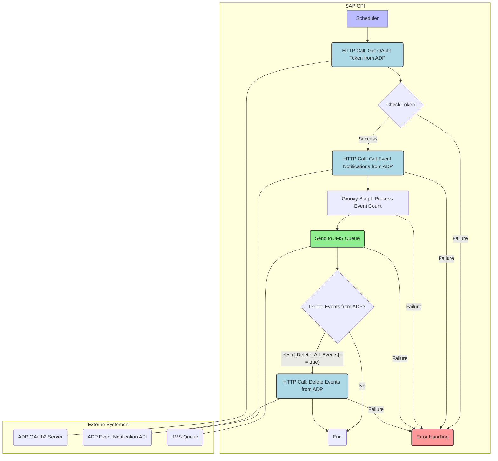
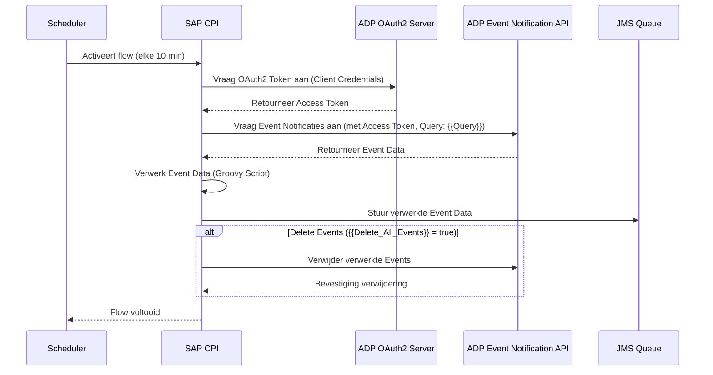

# ADP01_-_ADP_To_SAPERP_-_Event_Notification - Wijzigingen events ophalen in JMS queue plaatsen

**Versie:** 1.0.11
**Platform:** SAP Integration Suite (Cloud Integration)
**Beschrijving:** Wijzigingen events ophalen in JMS queue plaatsen

---

## 1. Tekstuele Beschrijving

### Doel
Deze integratie haalt periodiek wijzigingsevents op van het ADP-systeem en plaatst deze in een JMS-queue voor verdere verwerking door downstream-systemen, zoals SAP ERP. Het doel is om een betrouwbare en geautomatiseerde synchronisatie van werknemersevents te garanderen tussen ADP en SAP.

### Procesverloop (Happy Path)
1.  **Start (Scheduler):** De integratie wordt geactiveerd door een cron-gebaseerde scheduler, geconfigureerd om elke 10 minuten te draaien tussen 7:00 en 18:00 (UTC+1, Central European Standard Time).
2.  **OAuth Token Ophalen (HTTP Call):** De iFlow roept het ADP OAuth2 token endpoint aan (`{{ADP Host}}{{ADP Path}}`) om een toegangstoken te verkrijgen. Dit gebeurt met Client Credentials (`{{client-id}}`, `{{client-secret}}`) en de `{{ADP Credentials}}` alias. Het verkregen token wordt gebruikt voor verdere API-aanroepen naar ADP.
3.  **Event Notificaties Ophalen (HTTP Call):** Met het verkregen OAuth-token roept de iFlow de ADP Event Notification API aan (`{{ADP Host}}{{ADP Worker Path}}`). De query wordt beperkt door de parameter `{{Query}}` (standaard `$top=100`), wat aangeeft dat maximaal 100 events per keer worden opgehaald.
4.  **Event Verwerking (Groovy Script - `script1.groovy`):** Voor elk opgehaald event wordt het Groovy script `script1.groovy` uitgevoerd. Dit script leest de `eventName` property uit de message properties en incrementeert een teller (`${eventName}.count`) voor dat specifieke event. Dit kan duiden op een voorafgaande Splitter-stap of verwerking per event.
5.  **Plaatsen in JMS Queue (JMS Sender):** De verwerkte events worden vervolgens naar een JMS-queue gestuurd. De specifieke queue naam is niet direct zichtbaar in de parameters, maar de `metainfo.prop` en `description` suggereren dit als de volgende stap voor verdere verwerking.
6.  **Optioneel: Events Verwijderen (HTTP Call):** Indien de parameter `{{Delete_All_Events}}` op `true` is ingesteld, wordt na succesvolle verwerking een API-aanroep gedaan naar ADP om de verwerkte events te verwijderen. Dit zorgt ervoor dat events niet opnieuw worden opgehaald.

### Foutafhandeling
*   De iFlow is geconfigureerd om een uitzondering te genereren bij het verlopen van de scheduler (`throwExceptionOnExpiry=true`).
*   De parameter `{{Error Logging Only}}` (standaard `false`) suggereert de mogelijkheid om fouten alleen te loggen zonder verdere actie, wat kan worden gebruikt in een exception subprocess.
*   De parameter `{{Datadog Logging Enabled}}` (standaard `false`) geeft aan dat er een optie is voor externe logging naar Datadog voor monitoring en foutanalyse.
*   Standaard SAP CPI foutafhandeling mechanismen zijn van toepassing, zoals retries en alerts, hoewel geen specifieke exception subprocessen zijn gedefinieerd in de aangeleverde bestanden.

---

## 2. Technische Gegevens Zender en Ontvanger

### 2.1 Zender: ADP (Event Notification API)
| Eigenschap | Waarde |
|---|---|
| Systeemnaam | ADP |
| Adapter | HTTP |
| Protocol | HTTPS |
| Adres (Auth) | `{{ADP Host}}{{ADP Path}}` |
| Adres (Data) | `{{ADP Host}}{{ADP Worker Path}}` |
| Authenticatie (Auth) | OAuth2 Client Credentials (via `{{ADP Credentials}}` alias) |
| Authenticatie (Data) | OAuth2 Access Token (verkregen via Auth-stap) |
| Query Parameters | `{{Query}}` (standaard `$top=100`) |
| Scheduler | Cron-gebaseerd: `0+0/10+7-18+?+*+*+*&trigger.timeZone=Europe/Amsterdam` (elke 10 minuten tussen 7:00 en 18:00 CET) |

### 2.2 Ontvanger: JMS Queue
| Eigenschap | Waarde |
|---|---|
| Systeemnaam | JMS Queue (voor SAP ERP) |
| Adapter | JMS |
| Protocol | JMS |
| Adres | (Niet gespecificeerd in parameters, typisch een queue naam) |
| Authenticatie | (Niet gespecificeerd in parameters) |
| Doel | Tijdelijke opslag van ADP events voor downstream-systemen |

### 2.3 Externaliseerbare Parameters
| Parameter Naam | Standaard Waarde | Beschrijving |
|---|---|---|
| `ADP Worker Path` | `/core/v1/event-notification-messages` | Het pad voor de ADP Event Notification API. |
| `ADP Credentials` | `beterbed sap btp acc` | De naam van de Credential Store entry voor ADP OAuth2 authenticatie. |
| `Query` | `$top=100` | Query parameters voor de ADP API call, bijv. voor paginering. |
| `ADP Host` | `https://api.eu.adp.com` | De hostnaam van de ADP API. |
| `Scheduler` | `<row><cell>dayValue</cell><cell></cell></row><row><cell>monthValue</cell><cell></cell></row><row><cell>yearValue</cell><cell></cell></row><row><cell>dateType</cell><cell>DAILY</cell></row><row><cell>secondValue</cell><cell>0</cell></row><row><cell>minutesValue</cell><cell></cell></row><row><cell>hourValue</cell><cell></cell></row><row><cell>toInterval</cell><cell>19</cell></row><row><cell>fromInterval</cell><cell>7</cell></row><row><cell>OnEveryMinute</cell><cell>10</cell></row><row><cell>timeType</cell><cell>TIME_INTERVAL</cell></row><row><cell>timeZone</cell><cell>( UTC 1\:00 ) Central European Standard Time(Europe/Amsterdam)</cell></row><row><cell>throwExceptionOnExpiry</cell><cell>true</cell></row><row><cell>second</cell><cell>*</cell></row><row><cell>minute</cell><cell>*</cell></row><row><cell>hour</cell><cell>*</cell></row><row><cell>day_of_month</cell><cell>?</cell></row><row><cell>month</cell><cell>*</cell></row><row><cell>dayOfWeek</cell><cell>*</cell></row><row><cell>year</cell><cell>*</cell></row><row><cell>startAt</cell><cell></cell></row><row><cell>endAt</cell><cell></cell></row><row><cell>attributeBehaviour</cell><cell>isRunOnceRequired,isScheduleOnDayRequired,isScheduleRecurRequired,isThrowExceptionOnExpiryVisible,isScheduleAdvancedVisible,isScheduleAdvancedStartEndVisible</cell></row><row><cell>triggerType</cell><cell>cron</cell></row><row><cell>noOfSchedules</cell><cell>1</cell></row><row><cell>schedule1</cell><cell>0+0/10+7-18+?+*+*+*&amp;trigger.timeZone\=Europe/Amsterdam</cell></row>` | XML-representatie van de scheduler configuratie. De cron-expressie is `0+0/10+7-18+?+*+*+*&trigger.timeZone=Europe/Amsterdam`. |
| `Error Logging Only` | `false` | Indien `true`, worden fouten alleen gelogd zonder verdere actie. |
| `tags` | `env:development, klant:Beter Bed` | Tags voor monitoring en categorisatie. |
| `delay` | `3000` | Een vertraging in milliseconden, mogelijk gebruikt na een API-aanroep. |
| `client-secret` | `027e6eae-aa06-49ec-af25-6ee814775e26` | Het client secret voor OAuth2 authenticatie met ADP. |
| `ADP Path` | `/auth/oauth/v2/token` | Het pad voor de ADP OAuth2 token endpoint. |
| `Delete_All_Events` | `false` | Indien `true`, worden events na verwerking verwijderd uit ADP. |
| `client-id` | `0bd80020-aa31-4a25-b89c-052e409d9b65` | De client ID voor OAuth2 authenticatie met ADP. |
| `Datadog Logging Enabled` | `false` | Indien `true`, wordt logging naar Datadog ingeschakeld. |

---

## 3. Diagrammen

### 3.1 Flow Diagram (Mermaid)


### 3.2 Sequence Diagram (Mermaid)


---

## 4. Veld Mapping

Er zijn geen message mapping (.mmap) of XSLT (.xsl) bestanden aangeleverd. Daarom kan er geen gedetailleerde veld mapping tabel worden gegenereerd. De transformatie van de ADP event data naar het formaat voor de JMS queue vindt waarschijnlijk plaats via Groovy scripts of een Content Modifier binnen de iFlow.

---

## 5. Samenvatting Dataflow

```
+-----------+     +-----------------+     +-----------------------+     +-----------------------+     +-----------------+
| Scheduler | --> | SAP CPI         | --> | ADP OAuth2 Server     | --> | ADP Event             | --> | SAP CPI         |
| (Trigger) |     | (Get Token)     |     | (Client Credentials)  |     | Notification API      |     | (Process Events)|
+-----------+     +-----------------+     +-----------------------+     +-----------------------+     +-----------------+
                                                                                                               |
                                                                                                               v
                                                                                                         +-----------------+
                                                                                                         | SAP CPI         |
                                                                                                         | (Send to JMS)   |
                                                                                                         +-----------------+
                                                                                                               |
                                                                                                               v
                                                                                                         +-----------------+
                                                                                                         | JMS Queue       |
                                                                                                         | (voor SAP ERP)  |
                                                                                                         +-----------------+
```
